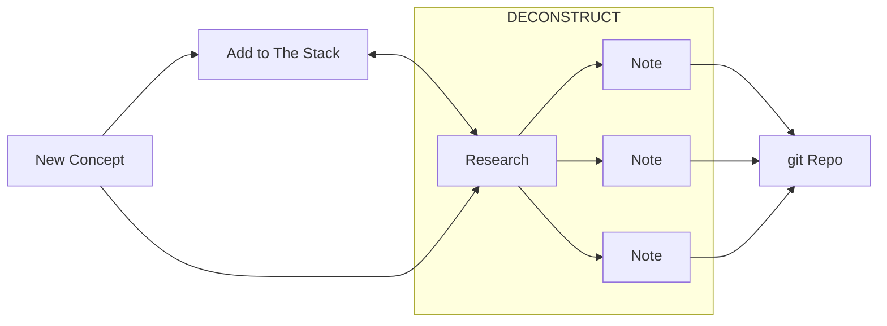

# Ross_Vault
Backup of my personal Obsidian Vault, feel free to copy. Goal is to keep updating this repository regularly in conjunction with new material as I learn it. 

### Contents
This is an online backup of my Obsidian notes. Topics include:
- Linear Algebra/Matrix Analysis
- Image analysis techniques
- Machine Learning
- Medical Imaging
- Probability
- Statistics

### Note Addition Pipeline
The general flow of the ingestion of information into the notes is:
1. Discover new concept or term. Either add it to `9999 The Stack` for investigation later or immediately research the topic
2. After sufficient research, deconstruct the concept into modular parts/concepts to create notes from. Notes in the process of being completed are placed into `Vault Gestation` to be worked on later. Often during research new concepts are found which get added to `9999 The Stack`
3. Push new notes to this repository as a backup

### Template Style Theory:
This is where I outline the reasoning/protocol for how I construct my notes.
**[[info_format]]:**
- "backlinks" should contain links to any other notes that may not be mentioned in the body of the note, but are useful for linking purposes.
- "source" relates to where this information was obtained, more than one source can be recorded.
- "Content" section should contain only the definition of the concept being represented by this note, with a simple example if necessary.
- "Properties" section should have the 
- "Additional Thoughts" relates to any information that you wish to add to the note that doesn't belong to any of the previous sections.
- When possible, resist creating notes which can be contained in the "Properties" section of other notes. New notes should only be made if the information is unique enough/cannot be relegated to being part of another note (combines too many different concepts with equal weight/importance)

**[[info_format_code]]:**
- Same rationale as [[info_format]], but with the additional "Useful Commands/Functions" addition. This should contain useful functions or uses of the discussed topic that are worth remembering.

**[[daily_format]]:** (redacted from the github repository due to the personal nature of the information.)
- Each daily_format file will consist of a weeks worth of entries/notes. The reasoning behind this is to consolidate the number of files floating around, as I found that my daily notes rarely pass 200 words. Keeping them grouped by week helps maintain a weekly narrative and minimizes number of windows to have open at a time.
- At the top of each weekly entry, there should be a "Weekly TODO" which contains a list of things I would like to accomplish this week. They can be different from the daily TODO entries, as what needs to be done from one day to the next may change.

**[[manuscript_format]]:**

**[[moc_format]]**:
Called the "map of content", these act as hubs for specific fields of notes. [CURRENTLY UNDER DEVELOPMENT]